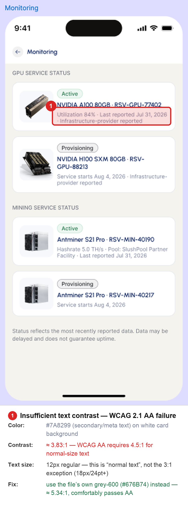

# Center AI Vision — Monitoring (Mobile)

An Expo/React Native implementation of the Monitoring screen, running on
iOS and Android from one shared codebase, reading live service-status
data from Center AI Vision's staging API. This is one half of a two-repo
trial deliverable — the corresponding Next.js web app lives at
[center-ai-web](https://github.com/thetronai/center-ai-web).

This screen is the **entire scope** of the trial (per the client's
brief): authentication, KYC, payments, and every other screen in the
shared Figma file are explicitly out of scope.

---

## Setup

Requires **Node 20+**, npm, and the [Expo Go](https://expo.dev/go) app
(iOS App Store / Google Play) or a simulator — Xcode's iOS Simulator
and/or Android Studio's emulator.

```bash
git clone https://github.com/thetronai/center-ai-mobile.git
cd center-ai-mobile
npm install
```

## Running it

```bash
npx expo start
```

Then, in the terminal that opens:
- press **`i`** for the iOS Simulator
- press **`a`** for the Android Emulator
- or scan the QR code with **Expo Go** on a physical device

The app calls `GET /config/system-status` on
`https://cav-backend-staging.onrender.com/api/v1` **directly** from React
Native — no server-side proxy needed here (unlike the web app), per the
client's spec: a browser-side call fails with no CORS headers, but a
native call is fine.

### A note on iOS Simulator specifically

The upstream API is behind Cloudflare with HTTP/3 advertised
(`alt-svc: h3`). iOS's QUIC negotiation over the *Simulator's*
virtualized network adapter is a known-flaky combination and can
intermittently throw `NSURLErrorNetworkConnectionLost` — this doesn't
reproduce on Android, on a physical iPhone, or via `curl` from the host
Mac. `lib/fetchSystemStatus.ts` retries a few times with backoff to
absorb this, which resolves it in practice. If it's still flaky:
- **Best fix:** use a physical iPhone with Expo Go instead of the
  Simulator — this sidesteps the issue entirely.
- **If Simulator-only:** Device menu → **Erase All Content and
  Settings**, then relaunch — this clears the stuck QUIC/Alt-Svc cache.

## How to force each state

The screen supports 5 states: `loading`, `success`, `empty`,
`error` (with retry), `offline`. Live data currently always returns the
success/happy path (`Operational` everywhere), so the other four are
reached via a deep link's query string — there's no on-screen control for
this, to keep the actual screen matching the design.

With the app already open, take the exact `exp://host:port` your
terminal printed when you ran `npx expo start` and append
`/--/?scenario=<value>`:

```
exp://127.0.0.1:8081/--/?scenario=error
```

**Easiest way:** open Expo Go's home screen and paste that URL into
"Enter URL manually."

**From the terminal**, once the app is open:

```bash
# iOS Simulator
xcrun simctl openurl booted "exp://127.0.0.1:8081/--/?scenario=error"

# Android Emulator — use the host:port your terminal printed,
# not 127.0.0.1 (the emulator's own loopback is a different network)
adb shell am start -a android.intent.action.VIEW -d "exp://<host-from-terminal>:8081/--/?scenario=error"
```

`<value>` is one of: `live` (default) · `loading` (parked indefinitely,
for screenshots) · `empty` · `error` · `rate-limit` · `offline`.

You don't need to force-quit between tries — firing the link again while
the app is already open updates the screen live.

Offline is also detected for real via `@react-native-community/netinfo`
— toggling Airplane Mode on device triggers it without the query param.

## Architecture notes

- `types/systemStatus.ts` — the typed contract (`Lane`, `StatusValue`,
  `SignalLevel`, `SystemService`) plus a runtime validator, mirroring the
  web repo's contract. No `any` anywhere in the codebase.
- `lib/fetchSystemStatus.ts` — direct fetch to the upstream API, with a
  30s timeout (the staging API is on Render's free tier, which cold-starts
  after inactivity) and a few retries with backoff for the iOS Simulator
  networking quirk described above.
- `hooks/useSystemStatus.ts` — the state machine, structured the same way
  as the web app's: `loading`/`offline` are derived during render rather
  than pushed via `setState` inside an effect; only the genuinely async
  fetch outcome uses `setState`.
- `hooks/useScenarioFromLink.ts` — reads `?scenario=` off a deep link,
  the mobile equivalent of the web app's URL query param.
- `screens/MonitoringScreen.tsx` — the screen: lane grouping
  (compute/mining/shared), status badges, and the 10-segment signal bar.
- `components/StateScreen.tsx` — shared template for offline/error/empty,
  matching the confirmed Figma "Global States" frames, with an
  optical-centering adjustment (the block is nudged up from dead-center
  since the filled button at the bottom reads as visually heavier than
  the icon/text above it).

## Figma correction

**Defect: insufficient text contrast on secondary/meta text (WCAG 2.1 AA failure).**

Figma dev-mode inspection confirms the meta/secondary text color used
throughout the file (e.g. the "Utilization 84% · Last reported Jul 31,
2026 · Infrastructure-provider reported" line under each service card) is
`#7A8299`, set at 12px regular weight on a white card background.

Computed contrast ratio: **`#7A8299` on `#FFFFFF` ≈ 3.83:1**.

WCAG 2.1 Level AA requires **4.5:1** for normal text. 12px regular is
well inside the "normal text" bracket (the 3:1 "large text" exception
only applies at 18pt/24px regular or 14pt/18.66px bold), so this text
falls short of AA — meaningfully harder to read for low-vision users, and
in bright ambient light on a phone screen.

**Why this is a real defect, not a nitpick:** the file's own Grey scale
already contains a token that fixes it without inventing a new color —
`grey-600 (#676B74)` computes to **≈5.34:1** against white, clearing AA
comfortably. This reads as a token-selection slip (a lighter shade than
the palette's own accessible options allow), not a deliberate design
choice, since nothing else in the file suggests this text is meant to be
de-emphasized to the point of an accessibility failure.



## What I'd do differently with more time

- **Resolve the reservation-card vs. system-status data-model mismatch
  properly with the client.** The Monitoring frame's actual content
  (reservation cards, `Active`/`Provisioning` badges, no `shared` lane,
  no signal bar) doesn't match the API contract (8 named services, 3
  lanes, 4 status values, 10-entry signal history). I built the
  lane/status/signal-bar UI as an original design extension of the file's
  visual language rather than a literal match, since nothing in the file
  shows it — with more time I'd get this confirmed/redesigned by the
  client rather than inferring it.
- **Get real designs for the `loading` and `empty` states.** Only
  `offline` and `error` exist in the "Global States" frames; I
  extrapolated `loading` and `empty` from the same template for
  consistency, which is a reasonable stand-in but not a substitute for
  an actual design.
- **Nail down the exact cream/off-white background hex.** Export and
  copy are disabled on the file, so `#F6F5F0` is a close visual
  approximation, not a confirmed value.
- **Root-cause the iOS Simulator networking issue** rather than
  mitigating it with retries — go deeper into the native networking
  layer instead of papering over it at the JS level.
- **Add automated tests** — unit tests for the contract validator and
  the state machine's transitions, plus a visual regression pass across
  all 5 states on both platforms.
- **Clean up unused dependencies** (`expo-secure-store`,
  `@react-navigation/*`) left over from an earlier, since-superseded
  version of the brief that included a login flow.

## Tech stack

Expo (React Native) · TypeScript · `expo-font` (Urbanist + Inter via
`@expo-google-fonts`) · `@react-native-community/netinfo` ·
`react-native-svg`
